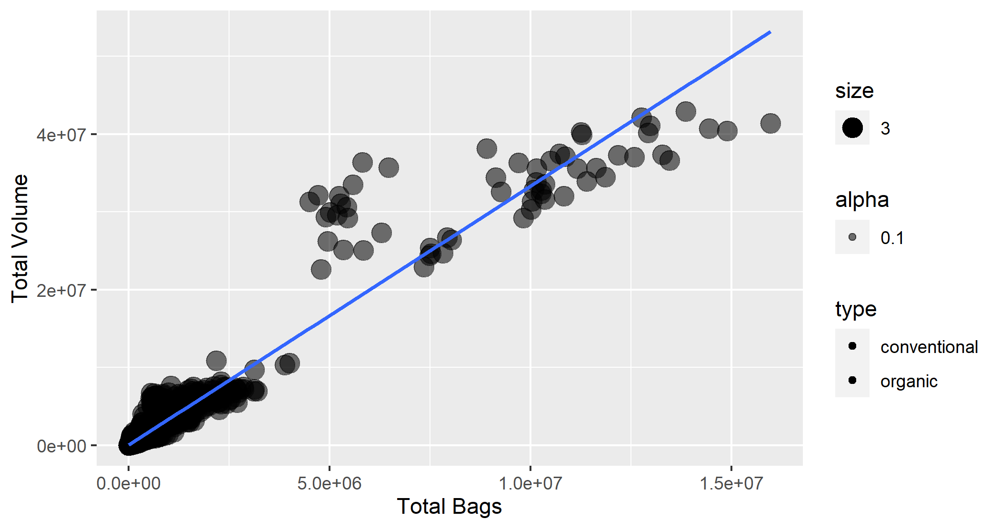

```{r setup, include=FALSE}
knitr::opts_chunk$set(error = TRUE, fig.width = 6, fig.asp = 0.618)
```

### I can import data from a variety of file types

The `data` folder contains three data files:

- `avocado.tsv` - information on Haas avocado sales in the US
- `avocado_regions.rds` - information on what states belong to different Haas avocado major regions
- `death_row_menus.csv` - information on 500 last meals for those on death row in the US

Read in these three datasets below and store them as tibbles with meaningful names.


### I can isolate information from a larger dataset

Using the `avocado` dataset, verify that the `Total Bags` is equal to the total of the `Small Bags`, `Large Bags`, and `XLarge Bags`. 

Your final solution should:

- Display *only* `Total Bags`, `Small Bags`, `Large Bags`, `XLarge Bags`, and `Total Check`, where
- `Total Check` is  the difference of `Total Bags` and the three bag sizes,


### I can combine information from multiple sources

Using the `avocado`, `death_row_menus`, and `avocado_region` datasets, create one tibble that contains the median `AveragePrice` of avocados and *number of* final meal requests for each avocado region.


### I can identify if information is presented in a tidy format and restructure information to be in a tidy format

Below I create a tibble of states that belong to different regions.

```{r}
region_states <- tibble::tribble(
   ~region       , ~state_abb,
  "Plains"       , "ND, SD, MN, NE, IA, KS, MO",
  "West"         , "WA, OR, ID, MT, WY, NV, UT, CO, AZ, NM",
  "Midsouth"     , "KY, VA, TN, NC, SC",       
  "Northeast"    , "WV, MD, DE, NJ, CN, RI, MA, VT, NH, NY, PA, ME",
  "California"   , "CA",
  "Southeast"    , "MS, AL, GA, FL",
  "SouthCentral" , "OK, AR, TX, LA",
  "GreatLakes"   , "WI, IL, IN, MI, OH"
)
```

1. Explain why these data are not in a tidy format.


2. Turn this data into a tidy version of the table. 


### I can put character data into a specified order

Using the `death_row_menus` dataset, create a graph of the number of death row meals per state - order the states by frequency. You must use a function from `{forcats}` to do this.


### I can use regular expression and other string patterns to manipulate text data

For the `death_row_menus` dataset, create the following variables:

- `Bacon`: Indicating whether that the inmate requested bacon to be part of their last meal (Yes or No)
- `WhiskeyBeerCigarettes`: Indicating whether that inmate requested one of these items were requested to be part of their last meal (Yes or No)
- `Digits`: For request that include numeric digits, select all of these values (e.g., if a request said "3 slices of bread, two packets of jelly, and 1 coffee", this entry would contain 3 and 1).


### I can use date/time data to extract portions or perform temporal calculations

For the `death_row_menus` dataset, convert `StateDate` into two columns:

- `State`: The full state name (double-check this when verifying) that is a Factor variable type that is ordered by ascending frequency, and
- `Date`: The date of the final meal as a Date variable type in `"yyyy/mm/dd"` format.

Once you are satisfied with your work, overwrite the dataset.


### I can create tables of numerical summaries that draw attention to important comparisons

In the `avocado` dataset there are six local `regions` that make up the Great Lakes region: Chicago, Cincinnati Dayton, Columbus, Detroit, Grand Rapids, and Indianapolis. Create a table that shows the difference in average price for organic and conventional avocados at each Great Lakes region markets.

Your table should display:

- The average price for each region and type of avocado combination,
- Restructure your table so that each type of avocado is a column, and
- Calculate the difference between the average price for each type.


### I can create graphical display of data that highlight key features

In the `avocado` dataset there are six local `regions` that make up the Great Lakes region: Chicago, Cincinnati Dayton, Columbus, Detroit, Grand Rapids, and Indianapolis. Create *one* visualization that shows the price comparison of organic versus conventional avocados for each of these six regions.

Your visualization should make organic versus conventional comparisons easiest within each region. I should be able to clearly see the distribution of organic avocado prices versus conventional avocado prices for Chicago, for Cincinnati Dayton, for Columbus, etc. In your visualization, be sure to use effective labels, titles, subtitles, user-specified colors, etc.


### I can combine multiple graphical displays or numerical summaries into an effective data product

Combine your table from **DS.1** and graph from **DS.2**. If you were not required to do one of those previous tasks, you still must complete it in order to complete **DS.3**. You must make sure that both your table and graph are not overlapping and all the information is easy to read.


### I can write a function that accomplishes a common analysis task

Write a function called `summarize_dataset` that takes a title string and a tibble as input and returns a string that says something like, "*title* has *#* rows and *#* columns".
For example, `summarize_table('our dataset', death_row_menus)` should return the string `"our dataset has 500 rows and 3 columns"`.
Test that your function works.


Write another function called `show_columns` that takes a string and a tibble as input and returns a string that says something like, "*dataset* has columns *name*, *name*, *name*, ...".
For example, `show_columns('Menus', death_row_menus)` should return the string `"Menus has columns Observation, StateDate, Meal"`.
Test that your function works.


### I can identify and correct common errors and in R programs

The `avocado` dataset has multiple measurements for each market.

The plot below shows this data, where:

- Each dot represents one date for each region *i*.
- The color of each dot represents whether it is conventional or organic avocado.
- The *X* coordinate for the date/region *i* is the total number of bags of avocados sold.
- The *Y* coordinate for the date/region *i* is the total volume of avocados sold.
- The line is created using the 'lm' method for all avocados (not the type of avocados) without the error band.



Re-create this plot using the tidyverse and ggplot2, fixing any mistakes you notice along the way.


### I can explore new functions or packages and implement them into analysis

1. Download the **Excel** workbook from [this location](https://introstat.weebly.com/handwriting-summary.html) and upload it to your `data/` folder. Read this dataset into R and store it in a meaningful name. Explore the [`{readxl}`](https://readxl.tidyverse.org/) documentation for how to do this.


2. Download the **SPSS** datafile from [this location](https://introstat.weebly.com/tootsie-pop.html) and upload it to your `data/` folder. Read this dataset into R and store it in a meaningful name. Explore the [`{haven}`](https://haven.tidyverse.org/) documentation for how to do this.


## Attribution

Ideas for the Application were derived from [Greg Wilson](https://third-bit.com/about/)'s RStudio Instructor training.